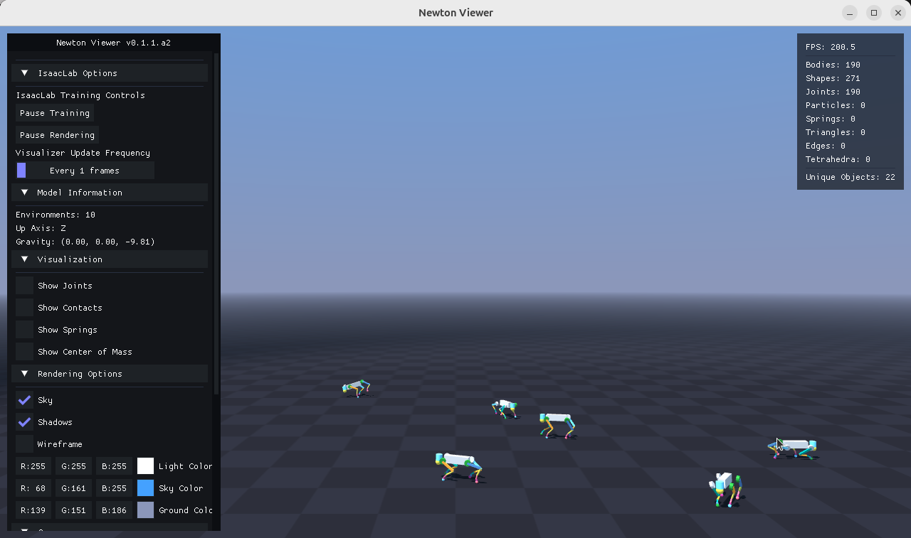

[](https://isaac-sim.github.io/IsaacLab/)
[](https://docs.isaacsim.omniverse.nvidia.com/latest/index.html)
[](https://docs.python.org/3/whatsnew/3.11.html)
[](https://releases.ubuntu.com/22.04/)
[](https://opensource.org/licenses/BSD-3-Clause)

# Policy training to Real deployement for Go2 Unitree Robot

## Overview

This project/repository trains a policy for go2 unitree robot and focuses on the Sim2Sim and Sim2Real using different environments.

**Key Features:**

1) [**Training**](#1-training)
    - [`a) Train`](#a-train) a policy for go2 robot using direct based environnement. The policy follows the commands sent by the user: linear (x/y) velocitiezs // angular (z) velocity // base height.
    - [`b) Test`](#b-test) it using keyboard in Isaacsim.
2) [**Sim2Sim**](#2-sim2sim)
    - [`a) Newton`](#a-newton) from PhysX to Newton using Newton branch of Isaaclab repo.
    - [`b) Unitree_mujoco`](#b-unitree_mujoco) from PhysX to Mujoco using the unitree_mujoco repo.
    - [`c) Huro`](#c-huro) sim2sim in huro environment (github of a researcher at LORIA).
3) [**Sim2Real**](#3-sim2real)
    - [`a) Unitree_python_sdk2`](#a-unitree_python_sdk2) sim2real in unitree_python_sdk2 using proprietary dds developed by unitree.
    - [`b) Huro`](#b-huro) sim2real in huro using ros2.
4) [**BONUS**](#4-bonus)

## Installation

- Install **Isaac Lab** following the [official installation guide](https://isaac-sim.github.io/IsaacLab/main/source/setup/installation/pip_installation.html) (tested with **Isaac Sim 5.1.0** and **Isaac Lab v2.3.1**).

- Clone or copy this project/repository separately from the Isaac Lab installation (i.e. outside the `IsaacLab` directory):
  
    ```bash
    git clone https://github.com/SamS709/go2_isaaclab.git
    ```
  
- Using a python interpreter that has Isaac Lab installed, install the library in editable mode using:

    ```bash
    # use 'PATH_TO_isaaclab.sh|bat -p' instead of 'python' if Isaac Lab is not installed in Python venv or conda
    cd go2_isaaclab
    python -m pip install -e source/go2_isaaclab
    ```

## 1) Training

### a) Train

Make sure you are in your the classic Isaac Lab Python environment (not the Newton branch).

- Train the Go2 locomotion environment:

    ```bash
    cd go2_isaaclab
    python scripts/rsl_rl/train.py --task Isaac-Velocity-Go2-Asymmetric-v0 --num_envs 4096 --headless
    ```

### b) Test

- Run the trained policy :

    ```bash
    python scripts/rsl_rl/play.py --task Isaac-Velocity-Go2-Asymmetric-v0 --num_envs 8 
    ```

- Control the robot with the keyboard (here, a pretrained checkpoint is used for convenience):

    ```bash
    python scripts/control/go2_locomotion.py --checkpoint pretrained_checkpoint/pretrained_checkpoint.pt --visualize
    ```

    

    Controls:

  - **Up/Down arrows**: Increase/decrease the robot's forward/backward velocity (x-axis)
  - **Left/Right arrows**: Increase/decrease the robot's left/right velocity (y-axis)
  - **E/R keys**: Increase/decrease the robot's height (z-axis position)
  - **F/G keys**: Increase/decrease the robot's angular velocity (yaw rotation)

## 2) Sim2Sim

### a) Newton

Look at the instructions avaible [`here`](https://github.com/SamS709/go2_isaaclab_newton).

The result after Sim2sim.



### b) Unitree_mujoco

#### Dependancies

It is highly recommended to set up a **Conda environment** with `python=3.10` and install the following packages:

- **[`unitree_sdk2_python`](https://github.com/unitreerobotics/unitree_sdk2_python.git)** (follow the [**Installing from source**](https://github.com/unitreerobotics/unitree_sdk2_python?tab=readme-ov-file#installing-from-source) instructions)

- **[`unitree_mujoco`](https://github.com/unitreerobotics/unitree_mujoco)** (follow the [**Python Simulator**](https://github.com/unitreerobotics/unitree_mujoco?tab=readme-ov-file#python-simulator-simulate_python) installation instructions)

In the `/unitree_mujoco/simulate_python` directory, set `USE_JOYSTICK = 0` in `config.py` to allow the simulation to start without a connected joystick.

```python
ROBOT = "go2" # Robot name, "go2", "b2", "b2w", "h1", "go2w", "g1" 
ROBOT_SCENE = "../unitree_robots/" + ROBOT + "/scene.xml" # Robot scene
DOMAIN_ID = 1 # Domain id
INTERFACE = "lo" # Interface 

USE_JOYSTICK = 0 # Simulate Unitree WirelessController using a gamepad
JOYSTICK_TYPE = "xbox" # support "xbox" and "switch" gamepad layout
JOYSTICK_DEVICE = 0 # Joystick number

PRINT_SCENE_INFORMATION = True # Print link, joint and sensors information of robot
ENABLE_ELASTIC_BAND = False # Virtual spring band, used for lifting h1

SIMULATE_DT = 0.005  # Need to be larger than the runtime of viewer.sync()
VIEWER_DT = 0.02  # 50 fps for viewer
```

Finally, install the `PyYAML` package:

```bash
pip install torch PyYAML
```

#### Installation

Copy and paste the `/go2_mujoco` directory, located inside the `/sim2sim` folder, into the `/unitree_mujoco` root directory.

#### Sim2sim

In one terminal (launch the simulation):

```bash
python unitree_mujoco.py 
```

In another terminal (start the policy):

```bash
python go2_publisher.py --vel-x=-0.5 --policy=policy_newton.pt --mapping=newton
```


### c) Huro


See the instruction at [`Sim2real with Huro`](#b-huro) (they are already provided here) 

## 3) Sim2Real

### a) Unitree_python_sdk2

Follow the instructions provided <a href = "https://github.com/SamS709/go2_unitree.git">here</a>

### b) Huro

[Huro](https://github.com/hucebot/huro) is a costum ROS 2 interface for Unitree robots.

Clone the [`sami`](https://github.com/hucebot/huro/tree/sami) branch:

```bash
git clone --single-branch --branch sami https://github.com/itsikelis/huro.git
```

Follow the instructions provided in the [README](https://github.com/hucebot/huro/blob/sami/README.md) to see how to deploy a policy in simulation or in the real robot.

## 4) BONUS

Beta: lidar integration avaible here: [go2_lidar](#https://github.com/SamS709/go2_lidar)


